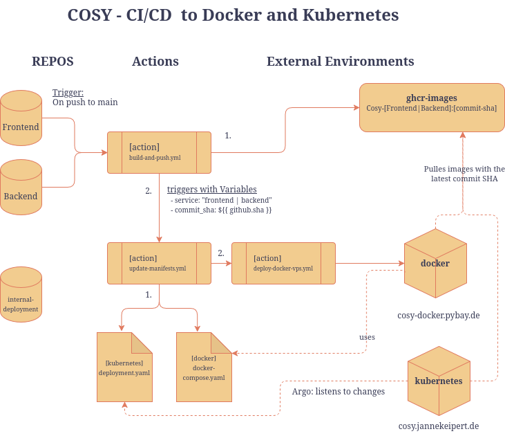

# Cosy Internal Deployment Repository

This repository contains the deployment configurations for the internal Cosy test environments. It includes configurations for both run-modes: Kubernetes and Docker Compose.

## CI/CD Deployment Flow

## Project Structure

*   **`kubernetes/`**: Kubernetes manifests (deployments, services, ingresses, database)
*   **`docker/`**: Docker Compose configuration for VPS deployment
    *   `docker-compose.yml` - Service definitions
    *   `SETUP-VPS.md` - Complete VPS setup guide
    *   `ansible/` - One-time VPS setup automation
*   **`.github/workflows/`**: GitHub Actions workflows
*   **`assets/`**: CI/CD flow diagrams

## Deployment Methods

### Kubernetes (ArgoCD)

**Deployed via ArgoCD** - No GitHub Actions needed. ArgoCD automatically pulls and deploys changes.

- **ArgoCD Dashboard**: https://argo.jannekeipert.de/
- ArgoCD monitors this repository and automatically syncs changes
- Updates to `kubernetes/` manifests trigger automatic deployments

### Docker Compose on VPS (GitHub Actions)

**Initial Setup** (One-time): Use Ansible to configure VPS - see [docker/SETUP-VPS.md](docker/SETUP-VPS.md)

**Deployment** (Automated): GitHub Actions handles deployments via SSH

- Push to `main` → Automatic deployment
- Manual trigger via GitHub Actions UI
- Workflow: SSH → copy files → pull images → restart services

**Note**: Ansible is only for initial VPS setup. All deployments are 100% GitHub Actions.

## Quick Start

### For Kubernetes
1. Update manifests in `kubernetes/`
2. Push to `main`
3. Monitor at https://argo.jannekeipert.de/

### For Docker/VPS
1. **First time**: Follow [docker/SETUP-VPS.md](docker/SETUP-VPS.md)
2. **Deploy**: Push to `main` or trigger workflow manually
3. **Monitor**: GitHub Actions tab

